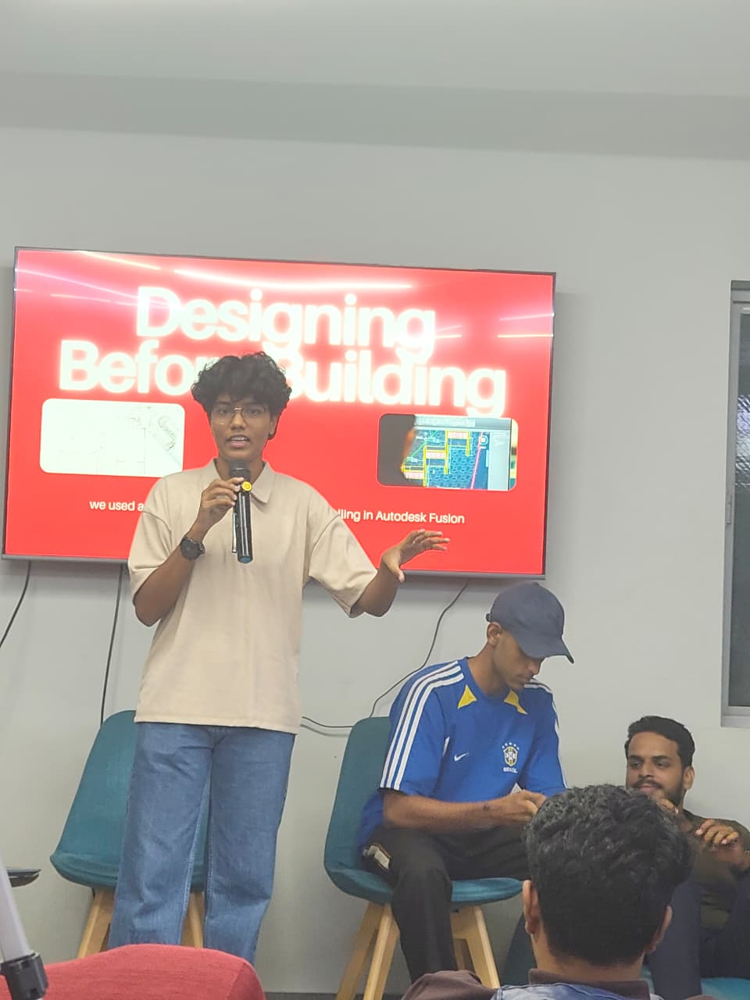
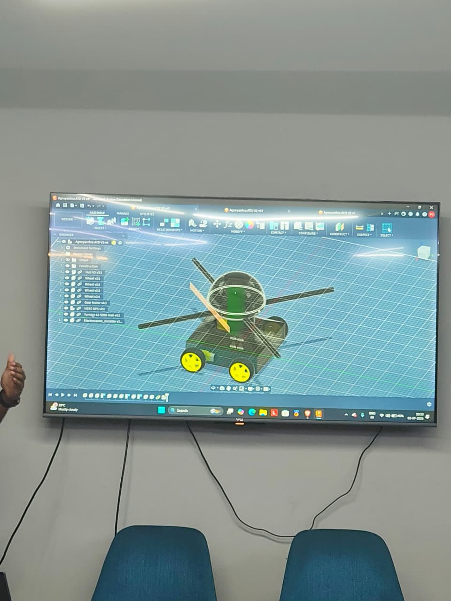

## Overview

This Maker Thursday, Madona, Pranav, Manas, and Suryajith presented their concept of a triphibious drone designed to operate across air, water, and land. They walked the makers through their proof of concept developed using Autodesk Fusion, sparking active discussions on its design, feasibility, and potential applications.

## Topics

- Concept and potential applications of a drone capable of operating across air, water, and land.
- Exploring the proof of concept using Autodesk Fusion.
- Design challenges, feasibility, and future possibilities of amphibious and multi-terrain drones.

## Project Presentation

- Madona, Pranav, Manas, and Suryajith – Triphibious Drone: A multi-terrain drone concept designed to navigate air, water, and land, presented through an Autodesk Fusion proof of concept.

## Photos

### Activity photo

## Highlights

- An engaging exchange of ideas around multi-terrain drone design, its real-world applications, and future possibilities, driven by active participation from the maker community.

## Next Week

- Topic: TBD
- Host: TBD
