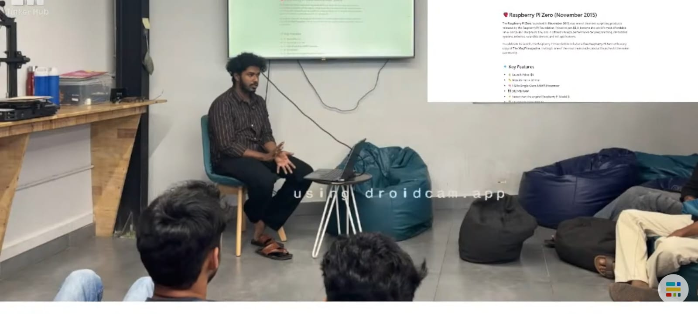

## Overview

This Maker Thursday, Anandhan introduced the Raspberry Pi ecosystem, setting the stage for Saturday’s Raspberry Pi Jam. The session explored the Raspberry Pi 5, its key features, and the possibilities it opens up for beginners and makers. Through practical use cases and project ideas, participants got a glimpse of how the platform can be used to bring creative computing projects to life.

## Topics

- Introduction to the Raspberry Pi ecosystem and the Raspberry Pi 5.
- Key features and capabilities of the Raspberry Pi 5.
- Real-world applications and project ideas for beginners.

## Photos

### Activity photo

## Highlights

- A beginner-friendly introduction to Raspberry Pi that built excitement for Saturday’s Raspberry Pi Jam and encouraged makers to explore the platform further.

## Next Week

- Topic: TBD
- Host: TBD
