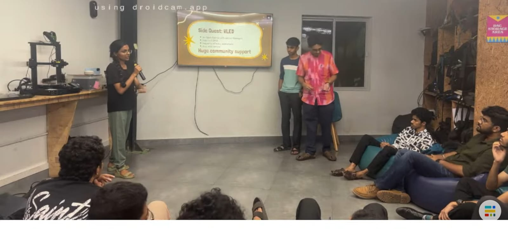

## Overview

This Maker Thursday, Ramakant, Agnivesh, and Amrutha shared their work on upgrading a massive LED wall featuring around 9,100 WS2812B LEDs. They walked the makers through the Teensy 4.1 and ESP32-based setup, discussed the challenges encountered during development, and demonstrated their working 9×10 test rig with interactive games and a mobile dashboard.

## Topics

- Building a large-scale addressable LED wall with WS2812B LEDs.
- Parallel LED control using Teensy 4.1 and ESP32.
- Debugging power delivery issues, signal crosstalk, and library bugs.
- Live demonstration of the test rig, games, and mobile dashboard.

## Project Presentation

- Ramakant, Agnivesh, and Amrutha – Massive LED Wall: A large-scale LED display project exploring parallel output, power management, and interactive control.

## Photos

### Activity photo

## Highlights

- A live demonstration of the working LED test rig, showcasing the challenges and possibilities of building a massive, interactive LED wall.

## Next Week

- Topic: TBD
- Host: TBD
