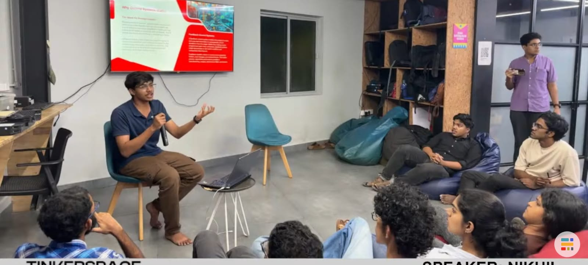

## Overview

This Maker Thursday, Nikhil introduced the fundamentals of PID control, explaining its role in applications like drone stabilisation and temperature regulation. A live maze solving robot demonstration brought the concepts to life, showing how adjusting controller gains can improve movement and reduce oscillations.

## Topics

- Introduction to Proportional–Integral–Derivative (PID) control.
- Understanding PID through real-world examples such as drone stabilisation.
- Exploring the effects of changing PID gains on system response and stability.
- Live robot tuning to observe PID control in action.

## Project Presentation

- Live PID Control Demonstration: Tuning a real robot in real time to demonstrate how PID gains affect movement, stability, and response.

## Photos

### Activity photo

## Highlights

- A hands-on demonstration that brought control theory to life, showing how tuning PID gains can make the difference between unstable and smooth robot movement.

## Next Week

- Topic: TBD
- Host: TBD
