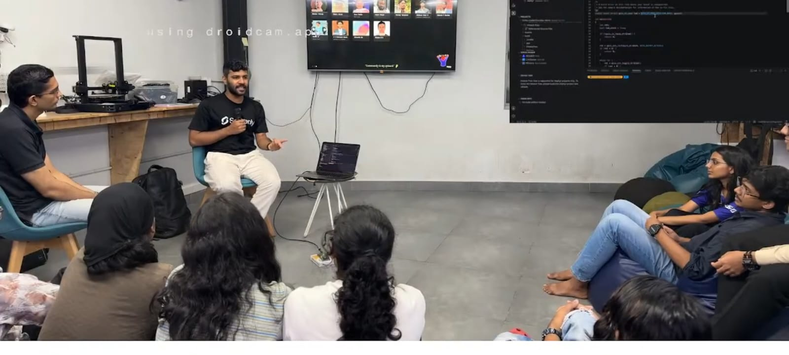

## Overview

This Maker Thursday, makers explored Zephyr RTOS, an open-source operating system designed for embedded and IoT applications. The session covered RTOS fundamentals, Zephyr’s role in the embedded ecosystem, and its use in building reliable firmware. Makers also explored the features and capabilities of the FRDM Development Board for MCX N23x MCUs, received through an NXP giveaway, and discussed its potential for hands-on embedded development.

## Topics

- Introduction to real-time operating systems (RTOS).
- Overview of Zephyr RTOS and its key features.
- Applications of Zephyr in embedded systems and IoT.
- Exploring the FRDM Development Board for MCX N23x MCUs.

## Project Presentation

- Exploring Zephyr RTOS: An introduction to Zephyr’s capabilities and its role in developing embedded and IoT applications.
- FRDM Development Board for MCX N23x MCUs: Exploring the features of NXP’s development platform and its potential for prototyping embedded applications.

## Photos

### Activity photo

## Highlights

- A session combining real-time operating system concepts with hands-on exploration of NXP’s MCX N23x development platform, opening up new possibilities for embedded projects.

## Next Week

- Topic: TBD
- Host: TBD
